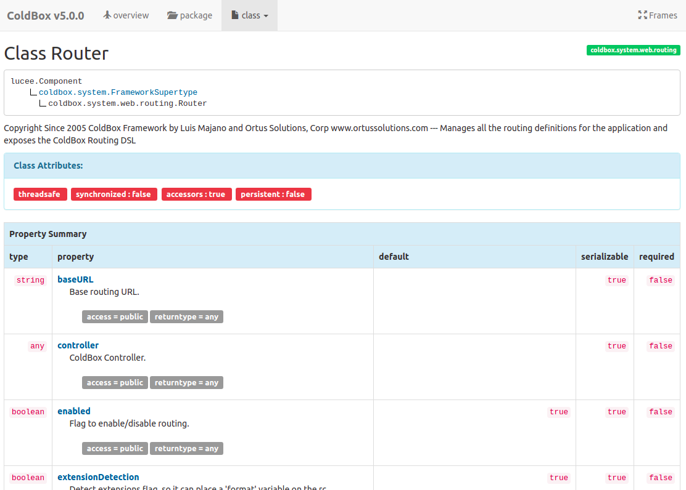

[](https://github.com/michaelborn/DocBox/graphs/contributors)
|
[](https://travis-ci.org/Ortus-Solutions/DocBox) 
| 
[](https://travis-ci.org/Ortus-Solutions/DocBox)
|


```text
██████╗  ██████╗  ██████╗██████╗  ██████╗ ██╗  ██╗
██╔══██╗██╔═══██╗██╔════╝██╔══██╗██╔═══██╗╚██╗██╔╝
██║  ██║██║   ██║██║     ██████╔╝██║   ██║ ╚███╔╝ 
██║  ██║██║   ██║██║     ██╔══██╗██║   ██║ ██╔██╗ 
██████╔╝╚██████╔╝╚██████╗██████╔╝╚██████╔╝██╔╝ ██╗
╚═════╝  ╚═════╝  ╚═════╝╚═════╝  ╚═════╝ ╚═╝  ╚═╝
```

# Welcome to DocBox!

DocBox is a JavaDoc-style documentation generator for your CFML codebase based on Mark Mandel's ColdDoc project.

[Docs][1] | [Github][2] | [Ortus Community][3]



## FEATURES

* Read [JavaDoc comment blocks](https://www.oracle.com/technical-resources/articles/java/javadoc-tool.html#format)
* Document your class API - components, methods, and properties
* Generate HTML documentation
* Generate machine-readable JSON
* generate XMI file which can be converted to a UML diagram

## SYSTEM REQUIREMENTS

- Lucee 5+
- ColdFusion 2016+

## Usage

Use the DocBox library to generate API docs from your CFC files.  Install Docbox with CommandBox like so:

```bash
box install docbox
```  

### Standalone Application

If you want to use DocBox for document generation in your CFML application, then just drop it into any location and create a `/docbox` mapping to it.  You will then instantiate the `DocBox` generator class with a `strategy` and `properties` for the strategy.

```js
// use custom strategy found at class.path
docbox = new docbox.DocBox( strategy="class.path", properties={} );

// create with HTML strategy
docbox = new docbox.DocBox(
  strategy = "HTML",
  properties = { 
    projectTitle="My Docs", 
    outputDir="#expandPath( '/docs' )#"
  }
);
```

#### Generating Docs

To generate the documentation you will then execute the `generate()` method on the DocBox object and pass in the following parameters:

#### Generate Params

* `source` : A path to the source location or an array of structs of locations that must have a `dir` and `mapping` key on it.
* `mapping` : The base mapping for the folder source. Used only if `source` is a path
* `excludes` : A regular expression that will be evaluated against all CFCs sent for documentation.  If the regex matches the CFC name and path then the CFC will be excluded from documentation.


```js
docbox.generate( source="/my/path", mapping="coldbox" );

docbox.generate(
    source  = "#expandPath( '/docbox' )#",
    mapping = "coldbox",
    excludes = "tests"
);
```

Once the generation finalizes, you will see your beautiful docs!

#### Available Strategies & Properties

* `HTML` - **default**
  * `projectTitle` : The HTML title
  * `outputDir` : The output directory
* `JSON`
  * `projectTitle` : The HTML title
  * `outputDir` : The output directory
* `XMI`
  * `outputFile` : The output file

### CommandBox Command

There is a related project you can install which wraps up the DocBox library in a Custom CLI command so you can generate API docs from the command line.

```bash
box install commandbox-docbox
```
Read more here: https://github.com/Ortus-Solutions/commandbox-docbox

----

## LICENSE

Apache License, Version 2.0.

## BUGS + NEW FEATURES

Please use our Jira instance to create bugs and new feature issues: https://ortussolutions.atlassian.net/projects/DOCBOX

## CREDITS & CONTRIBUTIONS

Thanks to Mark Mandel for allowing us to fork his project.

I THANK GOD FOR HIS WISDOM FOR THIS PROJECT

## THE DAILY BREAD

"I am the way, and the truth, and the life; no one comes to the Father, but by me (JESUS)" Jn 14:1-12

[1]: https://docbox.ortusbooks.com/
[2]: https://github.com/Ortus-Solutions/DocBox
[3]: https://community.ortussolutions.com/c/communities/docbox/17

## Have Questions?

Come find us on the [CFML Slack](http://cfml-slack.herokuapp.com/) (#box-products channel) and ask us there.  We'd be happy to help!

## Ortus Community

Join us in our Ortus Community and become a valuable member of this project https://community.ortussolutions.com/c/communities/docbox/17. We are looking forward to hearing from you!
